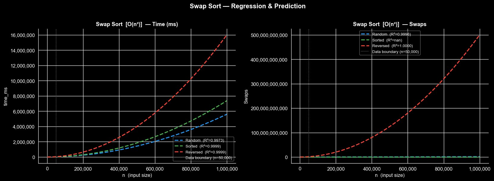
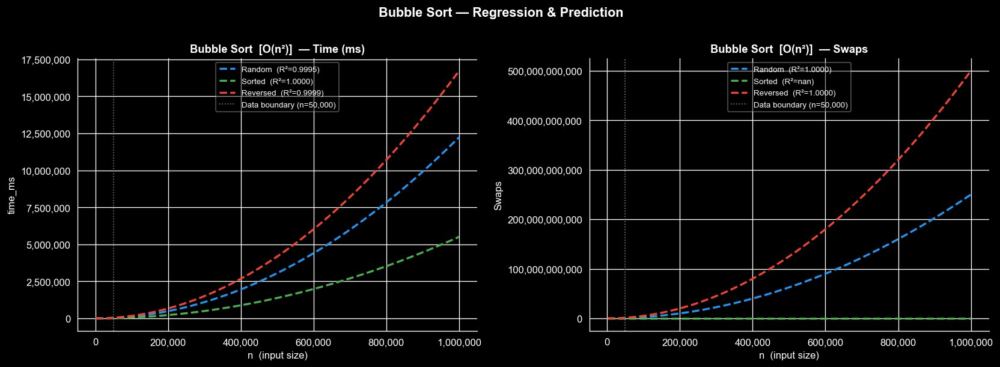
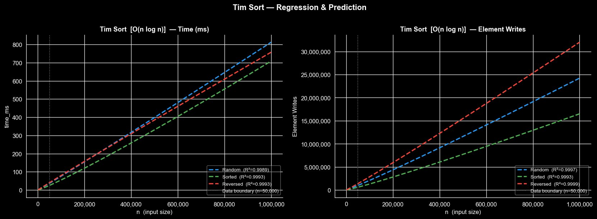

# Sorting Algorithms — Benchmark & Analysis

A benchmark suite for 20 sorting algorithms implemented in C++, with Python-based regression analysis and complexity curve fitting.

---

## Project Structure

```
Sorting_Algorithms_Analysis/
    Sorting_Algorithms_Analysis.cpp   # C++ benchmark source
    sorting-results.csv               # Benchmark output data
    sorting_analysis_all.ipynb        # Python regression notebook
    README.md
```

---

## Algorithms Implemented

| Algorithm | Complexity (avg) | Counter Type |
|---|---|---|
| Swap Sort | O(n²) | Swaps |
| Bubble Sort | O(n²) | Swaps |
| Selection Sort | O(n²) | Swaps |
| Insertion Sort | O(n²) | Writes |
| Shell Sort | O(n log² n) | Writes |
| Merge Sort | O(n log n) | Writes |
| Quick Sort (Recursive) | O(n log n) | Swaps |
| Quick Sort (Iterative) | O(n log n) | Swaps |
| Heap Sort | O(n log n) | Swaps |
| Intro Sort | O(n log n) | Writes |
| Tim Sort | O(n log n) | Writes |
| Bitonic Sort | O(n log² n) | Swaps |
| Tree Sort | O(n log n) avg | Writes |
| Cocktail Sort | O(n²) | Swaps |
| Comb Sort | O(n log n) avg | Swaps |
| Gnome Sort | O(n²) | Swaps |
| Count Sort | O(n + k) | Writes |
| Radix Sort | O(d·(n + k)) | Writes |
| Pigeonhole Sort | O(n + range) | Writes |
| Bucket Sort | O(n + k) avg | Writes |

---

## Benchmark Setup

- **Input sizes:** 1,000 to 50,000 elements (variable step)
- **Input cases:** Random (uniform distribution), Sorted ascending, Sorted descending
- **Repeats per measurement:** 3 (averaged)
- **Counter:** swaps or element writes depending on algorithm type
- **Language:** C++17, compiled with `-O2`

To regenerate the benchmark data:

```powershell
g++ -O2 -std=c++17 -o sorting Sorting_Algorithms_Analysis.cpp
.\sorting.exe | Tee-Object -FilePath sorting-results.csv
```

---

## Regression Analysis

The Python notebook (`sorting_analysis_all.ipynb`) fits each algorithm's benchmark data to its theoretical complexity curve using `scipy.optimize.curve_fit`.

| Complexity | Model function |
|---|---|
| O(n²) | a·n² + b·n + c |
| O(n log n) | a·n·log₂(n) + b·n + c |
| O(n log² n) | a·n·log₂(n)² + b |
| O(n) | a·n + b |

Each plot shows:
- Fitted curve for each input case (random / sorted / reversed)
- R² value confirming how well the data matches the theoretical model
- Prediction extended to n = 1,000,000
- Vertical boundary marking the limit of measured data

---

## Sample Results

### Swap Sort — O(n²)



### Bubble Sort — O(n²)



### Tim Sort — O(n log n)



---

## Key Observations

- All O(n²) algorithms confirm theoretical complexity with R² > 0.999 on random input.
- Quick Sort (Recursive) degenerates on sorted/reversed input due to last-element pivot selection, causing O(n²) behavior and stack overflow risk — excluded from those cases.
- Quick Sort (Iterative) avoids stack overflow using an explicit stack, maintaining O(log n) space.
- Intro Sort and Tim Sort achieve near-identical performance to Quick Sort on random input while guaranteeing O(n log n) worst case.
- Linear sorts (Count, Radix, Pigeonhole, Bucket) are orders of magnitude faster for bounded integer ranges.
- On sorted input, swap-based O(n²) algorithms perform zero swaps — R² is undefined for a constant zero sequence, which is itself a valid and expected result.

---

## Dependencies

**C++**
- Standard library only (C++17)
- Compiler: g++ or MSVC

**Python**
- `numpy`
- `pandas`
- `matplotlib`
- `scipy`
